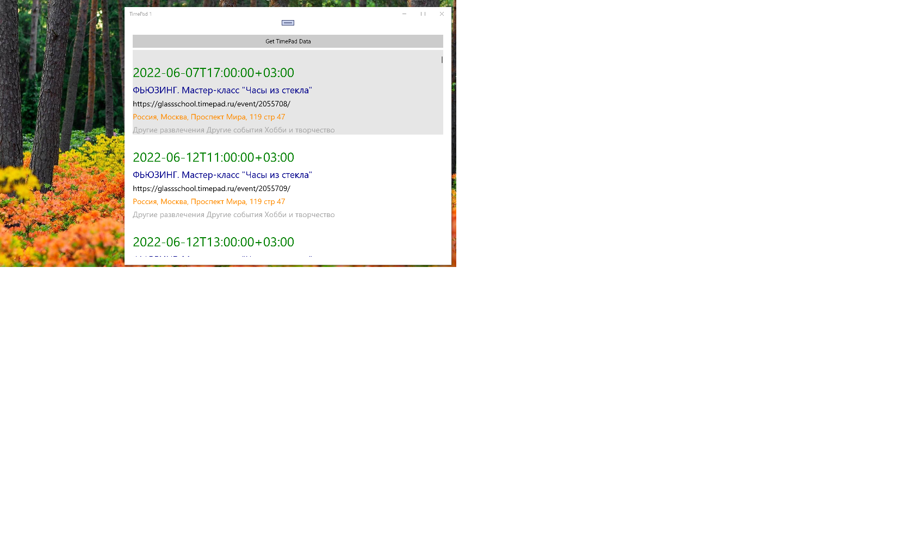

# Xamarin.Forms - TimePad proto

## Abstract
 This sample demonstrates how to consume REST-based web services from Xamarin.Forms applications (get started).

## Screenshots

## 2 words about tech

This sample demonstrates how to consume REST-based web services from Xamarin.Forms applications. 

Based on Microsoft's Web Service Tutorial.

## Status

Work-in-progress

Only simplest TimePad.ru's API support realized (even without json parsing)

## Useful links
For more information about this sample, 
see [Web Service Tutorial](https://docs.microsoft.com/xamarin/get-started/tutorials/web-service/).

-- [m][e] 2022

